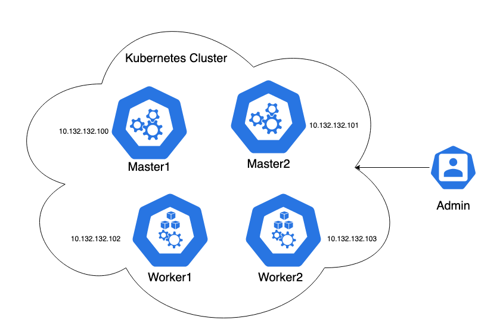

# Kubernetes In Real World
 

This is your Kubernets dream that WILL come true, a Real-World Kubernetes cluster with needed production enterprise services.

💥**in here we learn as we practice**💥

## About This Repo
📌 We are going to go through all the necessary components of kubernetes that is needed to deploy a cluster in your organization.

📌 I am going to explain all the details from 0 to 100.

📌 This also contains DevOps methods like using **Ansible**, **Terraform**, **Jenkins**.

## Overview
The cluster is looks like this:
- Two master nodes
- Two worker nodes

 

--------
## To Do
- part01 - Installing the cluster. ✅
- part02 - getting ready for production. ✅
- part03 - How to reach my application - LoadBalance! ✅
- part04 - How to reach my application - Ingress Controller ✅
- part05 - Where is my data (Storage solutions) ✅
  - part05.1 - NFS Dynamic Provisioning ✅
  - part05.2 - Glusterfs
- part06 - Monitoring
- part07 - Mr Jenkins, we need you
- part08 - Where is my CA Certificate
- part09 - Im tired of kubectl
- part10 - Lets wrap up

## Authors

- [@mozart4242](https://www.github.com/mozart4242)
