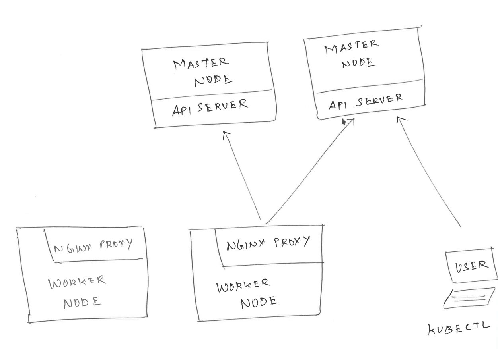

# Installing The Cluster

we are using VMware ESXI to provision our virtual machines.

|Role|RAM|CPU|DISK|Address|
|----|---|---|----|-------|
|Kmaster1|8GB|8|60GB|10.132.132.100|
|Kmaster2|8GB|8|60GB|10.132.132.101|
|Kworker1|8GB|8|60GB|10.132.132.102|
|Kworker2|8GB|8|60GB|10.132.132.103|

## How we do it?
I'm going to use a tool called [Kubespray](https://github.com/kubernetes-sigs/kubespray). Kubespray uses the power of [Ansible](https://www.ansible.com/) to provision your cluster.
Its easy and powerful.

## Deploying The Cluster
1- Download Kubespray

2- Prepare nodes

3- Configure Kubespray

4- Run


```
$ mkdir my-kubernetes && cd my-kubernetes
$ git clone https://github.com/kubernetes-sigs/kubespray.git

$ ssh-copy-id kadmin@10.132.132.100
$ ssh-copy-id kadmin@10.132.132.101
$ ssh-copy-id kadmin@10.132.132.102
$ ssh-copy-id kadmin@10.132.132.103

$ cd kubespray
$ sudo pip3 install -r requirements.txt
$ cp -rfp inventory/sample inventory/mycluster
$ declare -a IPS=(10.132.132.100 10.132.132.101 10.132.132.102 10.132.132.103)
$ sudo CONFIG_FILE=inventory/mycluster/hosts.yaml python3 contrib/inventory_builder/inventory.py ${IPS[@]}

$ ansible-playbook -i inventory/mycluster/hosts.yaml  --become --become-user=root cluster.yml
```
## Connect using your workstation
We need kubeconfig file in our ~/.kube/ directory to connect to our cluster.
So we need to download this file from one of our Control-Plane (master) nodes.

```
$ scp kadmin@10.132.132.100:/etc/kubernetes/admin.conf ~/.kube/config

$ sed -i 's/127.0.0.1/10.132.132.100/g' ~/.kube/config
```

By default we are going to connect to one of the master nodes, and the worker nodes will have nginx proxy as a load balancer so they can connect to both master nodes.

NOTE: if the first master node goes dfown we need to manually configure the kube file to connect to the other master node.
## Test our cluster

```
$ kubectl get nodes
```
As you can see, we are having a fully redundant and high available cluster with two master and two worker nodes.
